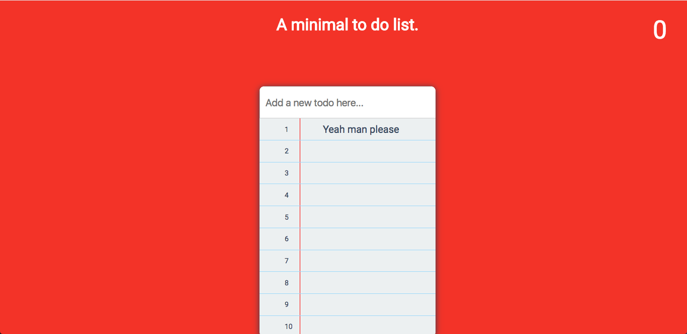

# MiniList: A minimal to do list.
This project is build on the purpose to familiarize myself with React. Might add more functionality in the future.

## What's the main function of this to do list?
1. The To do List only accept at most 10 items at once because it's about priority not quantity.
2. The point system will increase by 1 when you finish one task and decrease by 1 when you delete the task.
3. The input text field only accept less than 20 words.
4. Login system will be implemented in the next version.
